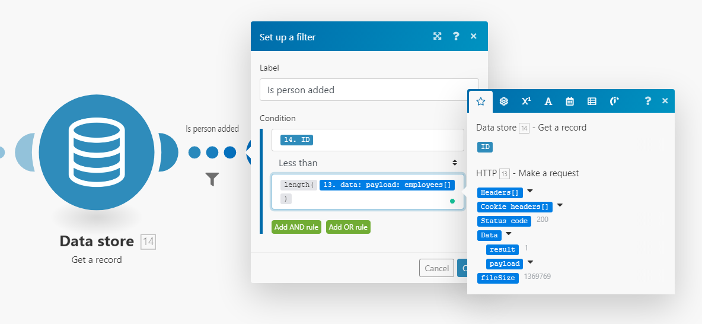
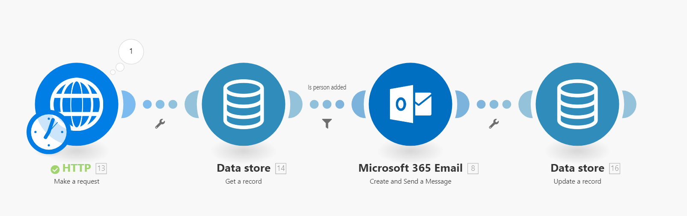
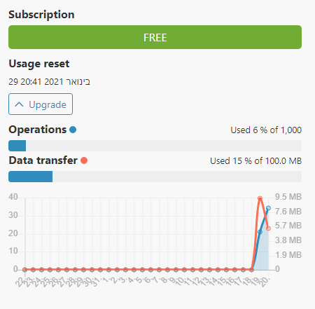
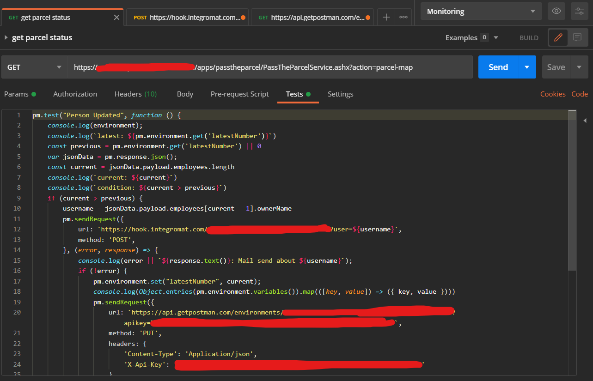
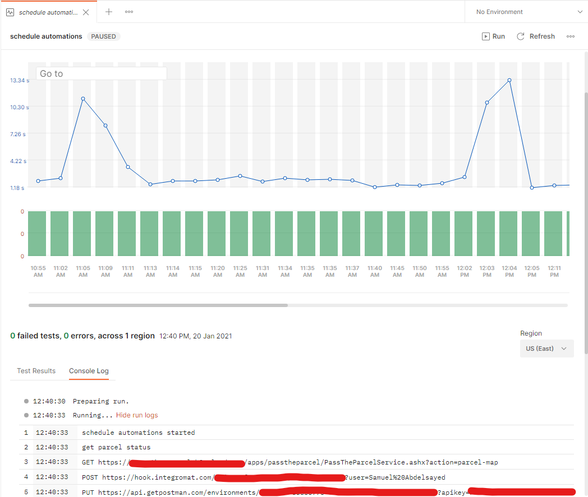

כידוע, אני חובב של דברים בחינם (או לא אוהב לשלם כסף, תלוי איך מסתכלים), וכידוע, פחות או יותר, אני חובב של פתרונות No-Code.

אני חושב שגם מתכנתים לא צריכים לכתוב קוד בכל פעם, כי זה תחזוקה, באגים, ועוד כל מיני דברים קטנים שאתה אף פעם לא חושב עליהם ושואבים אותך אל תוך הלילה.

אז הפעם, משחקים אצלנו בחברה "חבילה עוברת". לא קריטי הסיפור, וגם אני הייתי צריך לעצור את עצמי מלבדוק איך האתר המעפן שם עובד ומה אפשר לעשות איתו. לענייננו, יש דף שמציג אצל מי החבילה עברה, ומי מעביר אותה כרגע.

> בשביל לדעת איפה החבילה נמצאת צריך לרפרש את הדף כל פעם. אין התראה ואין כלום.  
> במילים אחרות, צריך לעשות pulling על הבקשה של הסטטוס ולראות אם החבילה עברה לעובד הבא.

אז זאת המשימה, בואו נראה איך פותרים אותה **מהצד ככה, לא הולכים לכתוב תוכנה מקצה לקצה**.

# Integromat

אז מתחילים מ[_Integromat_](https://www.integromat.com/), מתחרה של _Zapier_ ודומה ל*IFTTT*, למי שמכיר, והוא כלי בסיסי לכל פתרון No-Code. בIntegromat יש המון ממשקים להמון שירותים אינטרנטיים, והוא מאפשר לנו להגדיר תהליך משירות אחד לאחר, בממשק משתמש ידידותי, **ובלי לכתוב קוד**.

אז אנחנו רוצים **לבצע `HTTP Request`** לכתובת שלקחנו מתוך האפליקצייה (אתם יודעים, Network Tab, הדבר הראשון שמסתכלים באפליקציית SPA), ולקבל את רשימת האנשים שהחזיקו את החבילה.

לאחר מכן אנחנו רוצים לבדוק **האם נוסף אדם לרשימה**. מה זה אומר? שאנחנו צריכים לשמור את הכמות הקודמת. לצורך כך יש בIntegromat אפשרות לשמור נתון במין מסד נתונים מינימלי.

שלב שלישי הוא לשלוח התראה במידה ובאמת החבילה עברה לאדם נוסף. אין לנו _Slack_, ובשביל להתממשק ל*Microsoft Teams* צריך אישור מנהל, אז נאלצתי לבחור בשליחת מייל.

ובסוף, לשמור את כמות האנשים המעודכנת, בשביל הריצה הבאה. זה נראה כך:

הבעיה היא שהתכנית החינמית לא תחזיק מעמד הרבה זמן, בגלל שכל `HTTP Request` לוקח 1.5MB (כן! מוגזם).

מה אפשר לעשות כדי לחסוך את הבזבוז של הבקשה?

# Postman

אוקיי, את [_Postman_](https://www.postman.com/) כל מפתח חייב להכיר. כלי מאוד נוח לבצע בקשות HTTP ולנתח את הResponse.

האמת שPostman הוא הרבה הרבה יותר מזה, הוא נראה כמו כלי שיכול לעזור לנהל את כל הAPI שיש לנו, כולל אפשרות לשתף עם עוד אנשים. לצערי, לא יצא לי לקחת את הכלי יותר מידי צעדים קדימה, אז עכשיו שמחתי על ההזדמנות לאתגר קצת את Postman ולראות לאן הוא יכול להגיע.

המטרה היא לבצע את הבדיקה מול הAPI בתוך _Postman_, ורק כאשר המצב השתנה, לשלוח את המידע העדכני ל`Webhook` ב*Integromat* (כן, זה עוד שירות שהם תומכים, כמובן). כך אנחנו משתמשים ב*Integromat* רק כאשר באמת צריך לשלוח מייל.

בPostman יש אפשרות לכתוב בדיקות לAPI. כלומר, ניתן להריץ קוד _JavaScript_ אחרי קבלת `HTTP Response` שינתח את התשובה ויגיד _עבר_ או _נכשל_. אבל בסוף, מדובר ב*JavaScript*, וגם Postman עצמו תומך בעוד הרבה פעולות שניתן לבצע.

אחרי שכתבנו את ה"Test", הסקריפט שבודק אם כמות האנשים השתנתה, ובמידה וכן שולח את השם של האחרון ל*Integromat*, אנחנו רוצים להריץ אותו באופן קבוע, וגם זה נתמך ב*Postman*:

בדרך כלל ה"פיקים" בעצם אומרים שכמות האנשים השתנתה, ולכן לקח לסקריפט יותר זמן לרוץ, כי הוא מבצע עוד פעולות.

רק מה? גם לPostman יש מגבלה.

טוב, האמת שבשלב הזה, אחרי שכבר נאלצתי לכתוב הרבה קוד- יש בPostman איזה מגבלה בהקשר של שמירת מצב בין הרצות חוזרות (Monitoring), שלצורך כך צריך להשתמש בAPI של _Postman_ עצמו, וזה כבר הופך את העסק למסובך יותר.

אז יש לי כבר קוד _JavaScript_ בתוך _Postman_, תכל'ס במקרה הזה אולי עדיף להעביר אותו לסקריפט עצמאי. אני אולי מפסיד את הויזואליציה היפה של _Postman_, אבל מצד שני אני לא מוגבל בתכנית חינמית.

אז העברתי את הקוד ל*NodeJS*, כמעט Copy & Paste.

## מסקנות

אממממ...

טוב, קודם כל חסכתי ענייני Auth בכך שהשתמשתי ב*Integromat*, זה באמת חוסך הרבה מכאב הראש.

בעניין של לשלוף תשובה מAPI אחד ולהשתמש בה בAPI אחר, באמת שלא היה צריך יותר מאת _Integromat_. פשוט במקרה שלי, שאני רוצה לבצע את זה בקצב יחסית מהיר, ובחינם, נראה שגם _Postman_ פחות מתאים (כמה מפתיע, הוא אמור לשמש לבדיקות, שלא ממש אמורות לשמור מצב בין ריצות).

עדיין, הכרתי קצת יותר את הכלים, ואני אולי אדע קצת יותר בפעם הבאה איך לבצע אוטומציה עם כמה שפחות קוד.

# ובחינם, כמובן.
