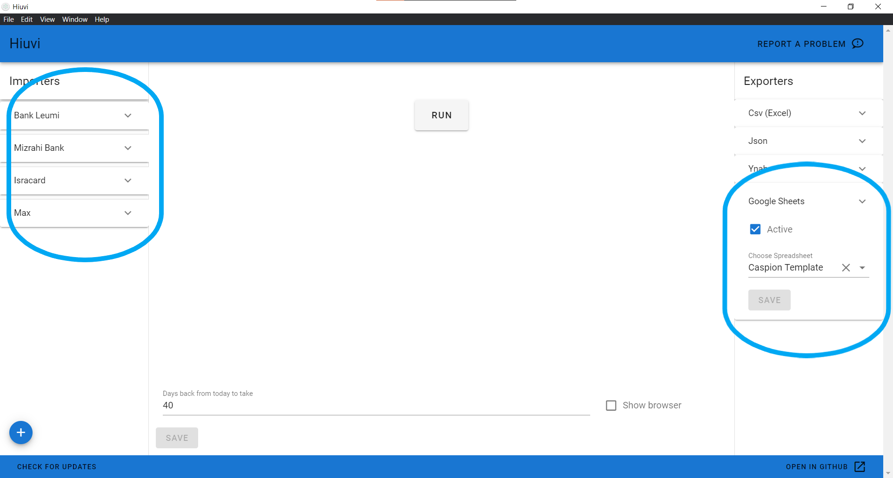
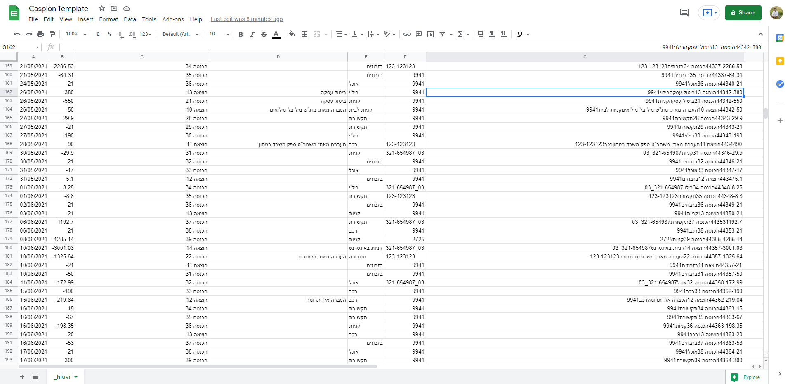
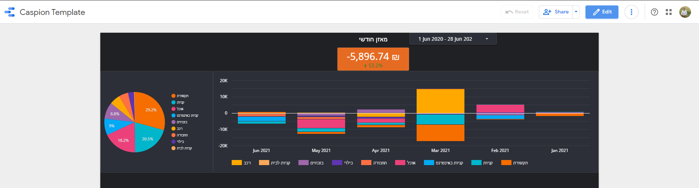
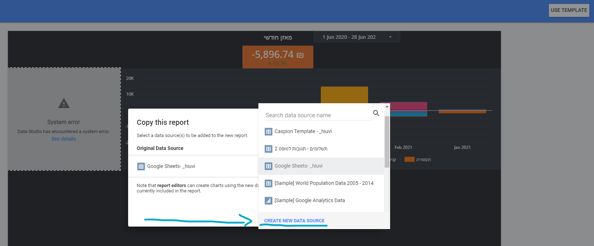
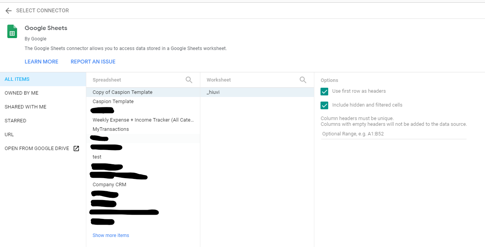

**אנחנו צריכים להכיר את העובר ושב שלנו**.

> האם הוצאנו החודש יותר ממה שהכנסנו?  
האם המחיר של האינטרנט קפץ פתאום כי נגמרה העסקה?  
האם הבנק התחיל לקחת עמלות פתאום?  
מים וחשמל, כמה זה יחסית לפעמים קודמות?  
כמה הוצאנו על בילויים החודש?

יש הרבה שאלות חשובות שצריך לשים לב אליהן, והרבה פעמים אפשר לראות באתר הבנק פילוח לפי קטגוריות, או אפילו להשתמש בשירותים חיצוניים, כמו [Riseup](https://www.riseup.co.il/), שמנסים ממש לעזור לנו לשלוט בהוצאות שלנו.

אבל הרגשתי שהשירותים האלו אף פעם לא מספיקים לי. הם לא מכירים את ההוצאות שלי כמו שאני מכיר אותן, וקשה לי להגיד להם דברים כמו "בסדר, החודש הוצאתי פי 2 רק כי דחיתי את התשלום של החודש הקודם".

כבר הרבה זמן שאני עובד על תוכנה שתעזור לי לנתח את הנתונים לפי הצורך שלי, והנה הצעה לשרשרת פשוטה של כלים שתעזור לכם לנתח את הנתונים לפי הקריטריונים שמעניינים אתכם.

## הגישה

אוקיי, אז שאלנו את השאלות בתחילת הפוסט, ואנחנו רוצים לענות עליהם, כל חודש, נניח.

הבעיה היא שככל שנידרש לעשות יותר פעולות, כך זה יהיה יותר מעמסה, ויידחה. לכן המטרה היא להפוך את התהליך לאוטומטי כמה שיותר, כדי ש**התשובות** לשאלות יהיו זמינות כמה שיותר בקלות, ונוכל פשוט לפתוח עליהן עין ולראות שלא קרה משהו חריג.

## קבלת הנתונים

אז הנתונים נמצאים באתר הבנק והאשראי, ואנחנו רוצים להוציא אותם לתוכנת ניהול נתונים, גליון אלקטרוני (Excel) למשל.

ידנית, מדובר בפעולה לא פשוטה בכלל.  
 קודם כל, אנחנו צריכים להיכנס לאתר הבנק (שלא תמיד ידוע בממשק המשתמש הנפלא שלו),  
 לבחור את טווח הנתונים ולהוריד אותו בפורמט נורמלי,  
 לאחד את הפורמטים שהורדנו לפורמט אחיד (או להחזיק כמה מסמכים פתוחים ולנתח אותם)  
 ולצורך קבלת פרספקטיבה גדולה יותר, גם לאחד את הנתונים עם נתונים ששמרנו מפעם קודם (להוריד כפילויות וכל זה).

> בשביל לפתור את הבעיה הזאת, פיתחנו את תוכנת [*כספיון*](https://brafdlog.github.io/caspion/)

אחרי שהורדתם את התוכנה, תצטרכו להכניס בצד אחד את פרטי הכניסה לחשבונות הבנק והאשראי שלכם, ובצד השני תצטרכו לבחור לאיפה לייצא את הנתונים.

במדריך הזה אני ממליץ להשתמש בייצוא ל**Google Sheets**, שיושב בחשבון הGoogle Drive שלכם באינטרנט ומאפשר להתממשק עם כלי ניתוח מתקדמים.

> **חשוב מאוד!** הסיסמאות מוצפנות ונשמרות במחשב. משיכת הנתונים מתבצעת בדיוק כמו שאתם מבצעים אותה ידנית, על ידי פתיחה של הדפדפן בצורה אוטומטית וגלישה למסך הנתונים.
> עם זאת, נתינת הסיסמאות לתוכנה שהיא לא אתר הבנק היא בעייתית, וכדאי לבדוק את התוכנה היטב.

כמובן, ללחוץ על כפתור *Run*.

לאחר הריצה, תוכלו לראות שהנתונים נמצאים במסמך שהתוכנה יצרה.

## ניתוח הנתונים

האמת שזהו לדעתי.

יש לכם את הנתונים בגליון אלקטרוני, ויכולת הניתוח שלכם תלויה בידע שלכם בגליונות אלקטרוניים. אני ממליץ מאוד לשאול את עצמכם שאלות, ולראות אם אתם מצליחים ליצור נוסחאות או טבלאות שיענו עליהן. אפשר להיעזר במאמרים וקבוצות באינטרנט.

יכולת להשתמש בגליון אלקטרוני היא לא יכולת של מתכנתים. להיפך! בעזרת שימוש בגליון אלקטרוני תוכלו לפתור בעצמכם הרבה בעיות שחשבתם שאתם צריכים חבר מתכנת בשביל זה (ואפילו לבנות אפליקצייה בעצמכם, נסו את [Glide](https://bscstudent.netlify.app/glide)).

יש [פרויקט ישראלי נוסף](https://github.com/raziele/creditCardAnalysis) שמנתח קבצי נתונים מהבנקים, ומציג גרפים בתוך הגליון. אני מקווה שהוא [יתמוך בנו בקרוב](https://github.com/raziele/creditCardAnalysis/issues/10).

## הצגת הנתונים

כמו שאמרתי, ככל שיהיו לנו יותר חסמים, אנחנו פחות נשתמש במידע שלנו.

ניתוח הנתונים זה התעמקות יחסית חד פעמית בנתונים, כדי לברר משהו ספציפי או כדי להתאים את הנתונים לגישה מסוימת.

מה שלדעתי באמת חשוב זה הצגה של הנתונים, כך שברוב הפעמים, מספיק מבט אחד כדי להבין מה הסטטוס, אם אנחנו רואים מה שאנחנו מצפים לראות, או אם קרה משהו חריג.

אחרי נסיונות אני חושב שמצאתי ש[**Google Data Studio**](https://datastudio.google.com/overview) הוא הפתרון שהכי מתאים למקרה.

גם כאן העבודה עם *Google Data Studio* דורשת התאמה, וככל שלומדים יותר על התוכנה ניתן להוציא ממנה יותר. אם זה מרגיש לכם מורכב מידי, תמיד אפשר להשתמש ב*כספיון* כדי לייצא לתוכנת [YNAB](https://www.youneedabudget.com/) שתנתח את הנתונים עבורכם.

### יצירת עותק מהTemplate

יצרתי Template בסיסי עם נתונים מומצאים מ*כספיון*. אפשר להגיע אל הTemplate מהקישור [הזה](https://datastudio.google.com/u/0/reporting/fd383078-4d62-429d-b7da-998d299f1c65/preview) וללחוץ על כפתור *USE TEMPLATE*.

תצוגות ב*Google Data Studio* מתבססות על נתונים ממקורות חיצוניים. מכיוון שהTemplate מבוסס על נתונים מזויפים שלא משותפים איתכם, תצטרכו ליצור קישור חדש לגליון שנוצר על ידי *כספיון*.

במסך שנפתח, ניתן לראות אפשרויות רבות לייבוא נתונים. אנחנו נבחר כמובן ב*Google Sheets*.

תופיע לנו רשימה של הגליונות האחרונים שנגענו בהם, ונבחר את הגליון שנוצר על ידי *כספיון*.

לחיצה בצד ימין למעלה על *CONNECT*.

אפשר לראות ש*GDS* זיהה את העמודות שיש לנו, ואת סוג הנתונים שבהם. כעת אפשר ללחוץ שוב בצד ימין למעלה על *ADD TO REPORT*.

## סיכום

סיימנו עם ויזואליזציה מאוד פשוטה של הנתונים, ומכאן אפשר רק להתקדם.

אישית, יצרתי לעצמי גרפים של חיובים קבועים ועמלות, כדי לראות שאין חיוב שפתאום חרג מהשגרה.

נכון, כדי ליצור את התהליך הזה נדרשת קצת עבודה, אבל מי שמנסח לעצמו שאלות ספציפיות כמו שניסחתי בהתחלה, הרבה פעמים ימצא את עצמו משתמש בכלים מותאמים אישית כדי לענות על השאלות הספציפיות שמעניינות אותו.

> **בהצלחה!** ניתן לפנות אלי לכל שאלה שיש.
