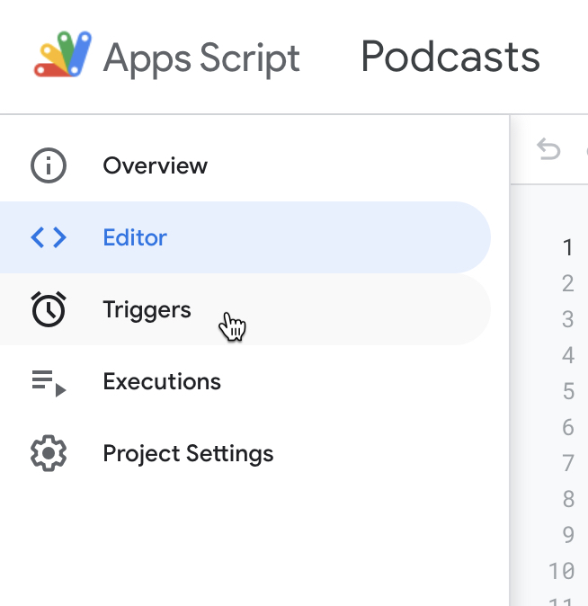

אוהבים להגיד שמתכנתים הם עצלנים, ולכן הם כותבים כל הזמן קוד כדי לא לעשות דברים פעמיים. אני לא ממש אוהב שאנשים מדביקים לעצמם תכונות טובות במסווה של תכונות רעות (או הפוך, לא סגור על זה. כמו פרפקציוניזם כמובן, וגם OCD), אבל בהחלט כחובב קוד, אני אוהב לעשות כל מיני אוטומציות, ובאופן כללי, לבצע פעולות שגרתיות מהר יותר ובכמות גדולה יותר (שזה בעצם היתרון של הקוד עלינו).

אז כבר צברתי לעצמי כל מיני אוטומציות כאלה, חלקם באמצעות שירותי No-Code וחלקם אפילו עם קוד, כי אין מה לעשות, הקוד מאפשר לנו את החופש.

הנה כמה דוגמאות לפרויקטים שעשיתי לעצמי.

- [בוט בטלגרם](https://github.com/alfem/telegram-download-daemon) שאני שולח אליו קבצי מדיה, והוא מוריד אותם לvolume שיש ספריית מדיה שקוראת ממנו.
- [ציוץ מחדש של ציוצי #פיד_תכנות בטוויטר](https://twitter.com/BcsStudent1), בעזרת [NodeRed עבור טוויטר](https://flows.nodered.org/node/node-red-node-twitter)
- חישוב אוטומטי של צריכת דלק (שווה פוסט בפני עצמו ככל הנראה)  
   

## מה הבעיה?

בסופו של דבר, לא מדובר פה באפליקציה עם לקוחות או מודל עסקי, שצריכה לרוץ על שרתים רציניים עם גיבויים ואבטחות. זה בסה"כ סקריפט שישמש אותי, אבל גם הסקריפט הזה צריך לרוץ איפשהו באופן קבוע ויציב. למשל [חלק מהבוטים רצים אצלי באיזה מחשב מדיה ישן](/home-server).

**להריץ על איזה מחשב ישן זה קצת בעייתי:**

- המחשב מאבד תקשורת לרשת מידי פעם.
- המחשב זמין רק פיזית (או רק בSSH מהרשת הביתית)
- כשיש לי אוטומציות שדורשות לשמור State, אני נכנס לתחום מורכב, אני יכול להרים DB, או לשמור הכל בקבצים, אבל כאן כבר כדאי לי להתעסק בגיבויים בצורה כלשהי, וחוצמיזה, מדובר בסקריפט בסה"כ, אין לי back office ועכשיו אני שוב צריך חיבור לDB או לעריכה של הקבצים.

כמובן, פתרון חלקי הוא להרים מכונה או שירות בענן, אבל זה עולה כסף, או שיש איזה תוכנית חינמית, אבל אני מתחיל להסתבך עם קונפיגורציות של DevOps וכל ההרשאות שם בAWS (או בOracle, לא משנה, שם ביקשתי עזרה מהחבר הDevOps שלי רק כדי להתחבר למכונה שהרמתי).

אז בעצם אנחנו מחפשים שירות ענן, עם גישה נוחה ומאובטחת פנימה והחוצה (ועם ממשק ניהול נוח, אבל יאללה כמה אפשר לדרוש).

טוב, אני לא אוהב מאמרים עם הקדמות, אבל כל זה היה כדי להסביר למה הפתרון הזה פשוט ומדהים, אז לעניין:

## Google Apps Script

נבחן רגע את הדרישות שהגדרנו.

- **מחיר:** [חינם](https://developers.google.com/apps-script/guides/services/quotas) (כלומר, יש איזה רף שממנו מתחילים לשלם (freemium) אבל קשה להגיע אליו בסקריפטים אישיים).
- **גישה:** רק למשתמש יש גישה, זה מסמך/שירות של גוגל, כמו Gmail או docs (אלא אם פותחים endpoint ספציפי, נראה בהמשך).
- **תקשורת:** תמיד (אני מקווה, בטוח יותר ממחשב שמחובר אצלי לרשת הביתית).
- **ממשק חיבור:** חיבור דרך הדפדפן, מכל רשת אינטרנט.
- **נתונים:** זה קטע שממש אהבתי- אפשר תמיד לשמור את הנתונים בגליון אלקטרוני (Google Sheets), ואז אמנם הקוד רץ ומשתמש בהם, אבל אנחנו יכולים גם תמיד לגעת בהם ידנית בצורה נוחה.

**עוד כמה נתונים על פיתוח בGoogle Apps Script (GAS):**

- **שפה:** JavaScript
- **שימוש בספריות:** מנגנון ספריות ייחודי ומוגבל, זה בהחלט חסרון.
- **סביבת פיתוח:** סביבה ייחודית של Google Apps Script. היא לא משוכללת יותר מידי, ובתור מתכנת היא מרגישה קצת מוגבלת, אבל במחשבה שניה ייתכן שלאנשים שלא מתכנתים ביום יום שלהם היא דווקא תהיה פשוטה ונוחה יותר.
- יש **דיבאגר**, יש **לוגים** (ברוב המקרים). אפשר אפילו לקבל מייל אם יש **שגיאה בזמן ריצה**.
- [אפשר להתממשק בקלות להמון שירותים של גוגל](https://developers.google.com/apps-script/reference) (שזה כבר חצי מהשירותים שקיימים בעולם ;-) )

### שליחת מידע לGoogle Apps Script

> מי שחשף אותי לכל התחום הזה של GAS ולאפשרויות הגלומות בו, וגם פיתח על גביו אפליקצייה די רצינית, הוא [עמרי](https://twitter.com/xomri/), אולי הגיע הזמן שתצטרפו ותעקבו אחריו.

בGAS אפשר לפתוח לקוד גישה חיצונית לבקשות GET & POST, מה שעקרונית מאפשר לנו התממשקות עם שירותים אחרים, על ידי שליחת מידע או קבלת מידע.

אני מאוד אוהב להשתמש בבוטים כדי להתממשק עם שרתים (כלומר שירות שמגיב בHTTP) כי זה הכי קרוב לCLI, ובטלגרם מאוד נוח לממש בוט, ולהשתמש בו אפילו מהפלאפון.

מכיוון שאי אפשר להשתמש בספריות קוד מnpm וכד', יש ספריות שפותחו במיוחד לGAS, ובמקרה שלא, קיבלתי קוד מעומרי, ויש קוד שמצאתי באינטרנט, ואני פשוט מעתיק מפרויקט לפרויקט (וכמובן גם כותב בעצמי).

> זאת הזדמנות למי שרוצה לתחזק איזה ספריה, למרות שזה קצת נישתי, אבל כן אפשר ללמוד מזה על תחזוקה, CI/CD, וכמובן לתת ערך לקהילה ולקוד הפתוח.

אז הנה הקוד להתממשקות עם טלגרם:

https://gist.github.com/baruchiro/4bab7004a05292b824fbe5f6d0bfdb2e#telegram.gs

כפי שניתן לראות בהערה, אחרי כל שינוי צריך לרשום מחדש את הקוד כאפליקצייה.

חשוב להבין שברגע שפיבלשנו את הקוד, זה מה שירוץ כשמישהו יבצע בקשת POST לכתובת של הפרויקט. אם נשנה את הקוד שלנו, הוא יריץ את הקוד המעודכן רק כשנריץ אותו מתוך GAS (בעזרת הדיבאגר או על ידי [טריגר](#טריגרים)), אבל כשנשלח הודעה מטלגרם, תרוץ הגרסה האחרונה שפיבלשנו.

**הערה קטנה לגבי Types בקוד.**

אמנם הEditor מאוד בסיסי ותומך רק בJavaScript, אבל הוא בכל זאת תומך ב*JSDoc Types*, אז כדי לקבל עזרה עם השלמת מילים, אפשר [להגדיר Types בהערות](/jsdoc-types).

#### אז מה אנחנו רואים בקוד?

בעקרון אין מודולים, אז קשה לשים לב לאיזה פונקציות מיועדות לשימוש בקבצים אחרים (בגלל שאין `export`). הפונקציות החשובות הן `sendMessage` ו`ReplyToSender`, בהן אנחנו יכולים להשתמש כדי לשלוח הודעות בטלגרם.

עוד דבר שחשוב מאוד לשים לב אליו זאת הפונקציה המיוחדת `doPost`. לא רואים שהיא מיוחדת, אבל כשמעלים את הפרויקט כWebApplication, אם שולחים בקשת POST לכתובת שקיבלנו, הבקשה תגיע ל`doPost` (ובהתאם, בקשת GET תגיע ל`doGet`).  
מכיוון שרשמנו את האפליקצייה שלנו כWebhook בטלגרם, בכל פעם שיקרה אירוע בבוט שלנו בטלגרם, אנחנו נקבל את האירוע כפרמטר של `doPost` על פי התיעוד של טלגרם.

https://gist.github.com/baruchiro/4bab7004a05292b824fbe5f6d0bfdb2e#main.gs

אני חושב שעד כאן הנושא של טלגרם, יש המון תיעוד על Telegram API, חבל להעמיס פה.

### שימוש בספריות

באותה גישה פחות או יותר, אנחנו עובדים עם טוויטר, רק שפה אנחנו נפגשים עם מנגנון הספריות של GAS. כדי לבצע קריאות API מול טוויטר, הקוד דורש מימוש של פרוטוקולי אימות, והם זמינים בספריות לGAS.

> הוראות מפורטות להגדרת אינטגרציה עם טוויטר אפשר למצוא [כאן](https://levelup.gitconnected.com/send-tweets-from-google-sheet-using-google-apps-script-d35382e901d8). אפשר גם להגיד לי מה חסר ואני אוסיף לפוסט.

כדי להוסיף את ספריית [twitter-lib](https://github.com/airhadoken/twitter-lib) יש ללחוץ על _הוספת ספריה_ בעורך הקוד:

בחלון ההוספה יש להכניס את מזהה הספריה (נכון לזמן כתיבת הקוד, הספריה זמינה בגרסה 25 עם המזהה `11dB74uW9VLpgvy1Ax3eBZ8J7as0ZrGtx4BPw7RKK-JQXyAJHBx98pY-7`)

לפי התיעוד, הספריה מבוססת כבר על ספריות פרוטוקולי האימות, אבל אני חושב שאני נדרשתי להוסיף את הספריות הללו בעצמי (שוב, לא מדובר במערכת משוכללת, אין dependencies). אז במידה ואתם נדרשים להוסיף את הספריות הללו, הנה הפרטים:

- `OAuth1` גרסה 18: `1CXDCY5sqT9ph64fFwSzVtXnbjpSfWdRymafDrtIZ7Z_hwysTY7IIhi7s`
- `OAuth2` גרסה 41: `1B7FSrk5Zi6L1rSxxTDgDEUsPzlukDsi4KGuTMorsTQHhGBzBkMun4iDF`

### טוויטר

כמובן, גם ההתממשקות לטוויטר דורשת הגדרה וקבלת מפתח. זה מעט יותר מסובך מאשר להתממשק לטלגרם, אבל אם כבר עשיתם את זה פעם אחת, זה נהיה פשוט יותר בפעם השנייה.

הנה הקוד:

https://gist.github.com/baruchiro/4bab7004a05292b824fbe5f6d0bfdb2e#twitter.gs

### טריגרים

אז יש לנו קוד שרץ על הפלטפורמה של GAS, וכבר ראינו שאם שולחים הודעה לבוט בטלגרם, הקוד יודע להגיב לזה. אבל כמובן שיש עוד מקרים, כמו למשל סקריפט שירוץ באופן קבוע.

אפשר ללכת להוספת טריגרים ולראות את האפשרויות. בקצרה (כמו שרואים בתמונה) אפשר לבסס על זמן ואפשר לבסס על אירועים בגליון האלקטרוני (במידה ויש גליון אלקטרוני שמחובר לסקריפט)

## סיכום

אני חושב שאפשר לעצור כאן. כמובן שיש עוד מה לפרט בכל מיני מקרים ואפשרויות, אבל חייבים להישאר ממוקדים. אני מקווה שהפוסט הזה יהיה התחלה של פוסטים וידע נוספים בעברית, ונוכל ללמוד יותר אחד מהשני.

מה בפועל אפשר לעשות עם סקריפטים קטנים כאלה? מתברר שהרבה.  
אני חושב שעמרי מבסס את [זזנו-בוט](https://zaznoobot.herokuapp.com/) על GAS.

מי שיש לו כבר אוטומציות, אני מניח שימצא כבר שימוש. למי שאין, הנה כמה רעיונות שאולי יפתחו לכם את התיאבון.

- **[סיכום פודקאסטים](<https://twitter.com/search?f=live&q=(%23%D7%A1%D7%99%D7%9B%D7%95%D7%9D_%D7%A4%D7%A8%D7%A7)%20(from%3Abaruchiro)%20filter%3Alinks&src=typed_query>):**  
  כשאני שומע פודקאסט בפלאפון, אני עושה share לבוט בטלגרם.  
  GAS מקבל את ההודעה ומחלץ מתוך הURL (בעזרת פונקציית [`IMPORTXML`](https://support.google.com/docs/answer/3093342)) את כותרת הפרק ושם הפודקאסט, ומוסיף אותם לטבלה בSheets.  
   בזמני הפנוי אני נכנס לאפליקצייה שבניתי בעזרת [Glideapps](https://www.glideapps.com/) וכותב סיכום לפרק ששמעתי. יש מיפוי אוטומטי משם הפודקאסט לתיוגים שאני רוצה להוסיף להודעה, אבל אם אני רוצה לתייג אורח למשל, אני מוסיף את התיוג שלו.  
   יש לי checkbox שאני מסמן כשהסיכום מוכן, וGAS מזהה אותו ובונה הודעה לטוויטר ולטלגרם, ומצייץ ושולח.
- **ארגון מסמכים:**  
  אני משתמש בתוכנת [paperwork](https://openpaper.work/) לתיוק המסמכים שאני מקבל בדואר ובמייל. התוכנה מסדרת אותם במבנה תיקיות וקבצים מסוים, אז יש לי פילטר במייל שמתייג הודעות קבועות שמכילות קובץ שאני רוצה לשמור, וGAS עובר על המייל אחת ל10 דקות ומוצא את ההודעות הללו, לוקח את הattachment, שומר אותו בDrive במבנה תיקיות הנכון ומשנה את התיוג של ההודעה.

### בונוס - ממשקים נוספים

קוד כל, אם קישרתם את פרויקט הGAS שלכם לGoogle Sheets, אני ממליץ לשמור את הstate שלכם בגליון (תכל'ס לא ידוע לי על דרך אחרת).

לי אישית יש קובץ עם קוד שאחראי על קריאה וכתיבה מהגליון, ואני מעתיק אותו מפרויקט לפרויקט.

אז אם שיקפתם את הנתונים שלכם בצורה מסודרת בגליון, קודם כל אתם יכולים לערוך אותם גם בלי הקוד, לשלוט בתוכנה מבחוץ.

אבל חוצמיזה, אני ממליץ לכם לבדוק את [GlideApp](https://www.glideapps.com/), בניית אפליקצייה מבוססת Google Sheets. תלוי מאיזה כיוון אתם מסתכלים על זה, אבל לכאורה אפשר להגיד שקיבלתם אפליקצייה, עם צד שרת וDB, והכל בחינם וכל כך פשוט.

זהו, אני אשמח לקבל פידבק, רעיונות נוספים ובלוגים מומלצים. תודה שקראתם עד כאן!
