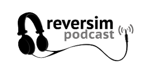

> **פודקאסט** (באנגלית: **Podcast**; על פי החלטות האקדמיה ללשון
> העברית: **הֶסְכֵּת**) הוא מעין תוכנית רדיו או טלוויזיה, המופצים
> באינטרנט באמצעות מנוי חינמי או בתשלום, וניתן להאזין להם בכל זמן ובכל
> מקום (Radio-On-Demand).

[ויקיפדיה](https://he.wikipedia.org/wiki/%D7%A4%D7%95%D7%93%D7%A7%D7%90%D7%A1%D7%98)

לא תמיד אנחנו מרוכזים בהתפתחות מקצועית, או יש לנו כוח לקרוא איזה ספר
מקצועי או לבצע איזה פרויקט. אבל לפעמים יש לנו זמן פנוי, בנסיעות
וכד', שאנחנו מרגישים שאנחנו רוצים לשמוע משהו שיקדם אותנו בחיים, בזמן
הריק של הנסיעה.

פודקאסט נותן לנו הזדמנות מצוינת להתפתח מקצועית ולהכיר את התעשייה שאנחנו
נכנסים אליה. כל אחד מהפודקאסטים פה מתמקד בתחום טיפה שונה, כמו שתראו,
וביחד הם עוזרים לנו להכיר את השפה, הטכנולוגיות וההתמודדויות של תעשיית
התוכנה.

### [עושים תוכנה](https://www.ranlevi.com/software/)

אני מציג את הפודקאסט הזה ראשון, בגלל שלדעתי, כסטודנטים הוא הכי מתאים
לנו. הפודקאסט **עושים תוכנה** מבית [עושים
הסטוריה](https://www.ranlevi.com/), נכנס בצורה מאוד קלה לנושאים
שונים בעולם התוכנה, ומקפיד מאוד לדבר בשפה ברורה ולהסביר גם למי שבכלל
לא מכיר את הנושא.

[קבוצת הפייסבוק](https://www.facebook.com/groups/making.software/)

### [מפתחים חסרי תרבות](http://notarbut.co/)

בפודקאסט הזה, שאותו מנחים שני ראשי צוותי פיתוח, מראיינים אנשים מגוונים
מהתעשייה, או מדברים על נושאים שונים, שכולם קשורים ומשפיעים על **תרבות
הפיתוח** בחברה.  
איך גורמים למפתח לקחת אחריות על הבאגים שלו? איך עוזרים למפתח להרגיש שהוא
מתקדם? ועוד...  
כשאנחנו מקשיבים לפודקאסט הזה אנחנו קולטים את התמודדיות היום-יומיות של
אנשי התוכנה, שלא בהכרח קשורים ליעילות של מיון בועות.

[קבוצת הפייסבוק](https://www.facebook.com/notarbutpodcast/)

### [רברס עם פלטפורמה](https://www.reversim.com/)

פודקאסט ותיק מאוד. קבוצת הפייסבוק אמנם כמעט לא פעילה, אבל עיקר הפעילות
של הפודקאסט כיום היא סביב [כנס
רברסים](https://summit2019.reversim.com/), כנס מרכזי של הרצאות
מקצועיות במגוון נושאים שקשורים לפיתוח.  
ההרצאות מוקלטות ומשודרות אחר כך בפודקאסט, כך שלמרות שהנושאים בפודקאסט הם
מתקדמים יחסית, ההרצאות מהכנס מגוונות מאוד ויש שם דברים נפלאים.

[הלוגו באדיבות אדם בניון](http://www.binpress.com/)

 [קבוצת
הפייסבוק](https://www.facebook.com/notarbutpodcast/)

### [UNSUPERVISED](http://www.unsupervised-podcast.xyz/)

פודקאסט בנושא Data Science. כמו בפודקאסטים הקודמים, גם אם כרגע אנחנו לא
מדעני נתונים, בהקשבה לפודקאסט אנחנו לומדים את השפה, ומבינים את האתגרים
שאיתם אנשי הנתונים מתמודדים.  
אני כבר לא מקשיב לפודקאסט הזה, אבל הספקתי ללמוד ממנו כמה דברים,אז מומלץ
ביותר למי שמתעניין בתחום\!

## אפליקציות פודקאסט מומלצות

  - [BeyondPod
    (אנדרואיד)](https://play.google.com/store/apps/details?id=mobi.beyondpod)
  - [iTunes (אפל)](https://itunes.apple.com/us/app/podcasts/)
  - [Spotify (כל
    הפלטפורמות)](https://open.spotify.com/genre/podcasts-page)
