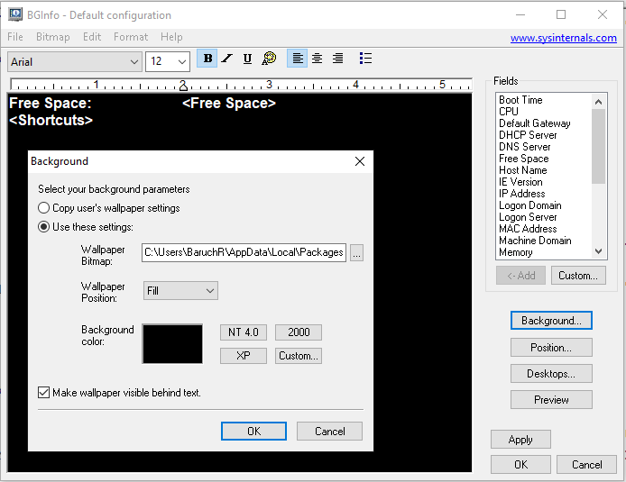

לאחרונה התחלתי לחשוש מהמחלה של ההייטקיסטים (ושל כל מי שיושב מול המחשב כל הזמן)- כאבים במפרק כף היד.

אני לא אכנס פה לכל הנושא ולכל הטיפים, כי אני לא מבין בזה. אבל נקודה אחת שאני מדבר עליה היא השימוש ב**עכבר המחשב**.

כן, תניחו רגע את היד שלכם על השולחן בצורה הטבעית שלה, בלי לסובב אותה, ותראו שהיא מונחת עם **האגודל למעלה**. עכשיו תנסו לתפוס את העכבר (בלי מלכודת) ותראו שמופעל מאמץ לכיוון לא טבעי של היד.

בקיצור, יש פה איזה בעיה, תשאלו מומחים או שתקראו על **עכבר אנכי**.

### מה אפשר לעשות?

הרבה דברים כמובן.

אישית, החלטתי כרגע להתמקד ב**הפחתת השימוש בעכבר**, שזה אומר להשתמש יותר במקלדת ולהיעזר בקיצורי מקשים כדי לבצע פעולות שגרתיות.

**הבעיה היא** שלכל תוכנה יש את קיצורי המקשים שלה, ולכן בבת אחת צריך לזכור איך עוברים מVSCode לכרום, איך עוברים לכרטיסיה של גוגל, איך חוזרים חזרה לVSCode ואיך עוברים למסמך אחר בתוך התוכנה.

### הטמעה

1. שמעתי טיפ נחמד שאומר שבמקום לנסות להשתלט על כל קיצורי המקשים, **לבחור בכל פעם את שתי הפעולות הנפוצות** שדורשות עכבר, ולנסות להחליף אותן בקיצורי מקשים.  
   כך, אחרי שמתרגלים להשתמש בקיצורי מקשים עבור שתי הפעולות הנ"ל, ניתן לבחור את השתיים הבאות וכן הלאה.
2. הדבר הנוסף שרציתי זה **לרשום במקום זמין את כל הקיצורים החדשים** שאני מנסה להשתמש בהם, כי אם בכל פעם שאני רוצה לבצע פעולה בעזרת המקלדת אני צריך לחפש בגוגל- **זה לא קיצור**.  
   אז מצאתי תוכנה חמודה שנקראת BGInfo, תמשיכו לקרוא.

### BGInfo- טקסט על שולחן העבודה

המקום הזמין שחשבתי עליו הוא _שולחן העבודה של Windows_. הוא תמיד שם, הרי. אפשר להשתמש בקיצור ", + WinKey" (כן, פסיק) כדי להציג אותו (בלי לעזוב את המקלדת).

רציתי דרך פשוטה לשים טקסט ברקע שולחן העבודה. כמובן שאני יכול לכתוב מסמך, לצלם אותו, ולשמור את התמונה כרקע. אולי אפילו אפשר לכתוב סקריפט שיעשה את זה.

אבל מתברר שיש תוכנה קיימת, שאולי כבר ראיתם אותה בשימוש, והיא מדביקה כל מיני פרטים טכניים על רקע שולחן העבודה, ואפשר גם לערוך ולשים טקסט מותאם אישית.

ניתן להוריד את התוכנה [מכאן](https://docs.microsoft.com/en-us/sysinternals/downloads/bginfo).

#### הסברים טכניים

בעקרון, אפשר פשוט להפעיל את התוכנה, לערוך את הטקסט, ובטח גם תרצו לוודא שמוגדר רקע, כדי שלא יהיה מסך שחור ומעצבן:

אגב, מה שאני עשיתי זה לייבא קובץ טקסט חיצוני שבו רשמתי את קיצורי המקשים, אבל זה לא חובה.
