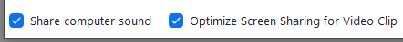

מדריך מפורט עם הרבה טיפים, שמבוסס על הפוסט אבל כולל הרבה יותר מידע, כדאי מאוד לראות:

<iframe width="560" height="315" src="https://www.youtube-nocookie.com/embed/YAU0ihrQKwU" frameborder="0" allow="accelerometer; autoplay; encrypted-media; gyroscope; picture-in-picture" allowfullscreen></iframe>

בשגרה החדשה שלנו, אנחנו מקבלים מגבלות חדשות מידי יום. זכיתי להיות אחד המוזמנים בחתונה של שלמה (אחי) וחן, והייתי אחראי על שידור חי של האירוע לצופים בבית.

מעבר לפרטים הטכניים שנציג פה, חשוב לשים דגש גם על הקשר עם הצופים ושאר הדברים, כי אנחנו מדברים פה על השתתפות של אנשים באירוע מרחוק, שזה עניין אנושי הרבה יותר מאשר עניין טכני.

> כשהחתונה יורדת מ500 איש ל100, וממאה ל10, כל אדם בחתונה מייצג 10 אנשים (או יותר)! זה אומר שכל אחד מאיתנו שנוכח בחתונה צריך למלא כמה תפקידים, כמו להיות המלצר ואחראי ההגברה ביחד, **וגם צריך לרקוד ולשמח כמו 10 אנשים!**

## המשתתפים מרחוק

### הכנה מראש

כדאי להכין מראש את הצופים בבית, כבר מהבוקר ואולי גם מלפני. אנחנו רוצים להכין את הצופים

- **בצד הטכני-** לשלוח להם קישור, להסביר להם איך לפתוח אותו אם צריך, לשלוח מישהו שיפעיל למבוגרים וכו'.
- **בהשתתפות-** כדאי להתכנס ולראות ביחד (אם מותר), אפשר ללבוש בגדים חגיגיים, להביא כיבוד, וכל דבר שיהפוך סתם "צפייה מרחוק" ל**חתונה אישית** בבית.

### קבוצת עדכונים

גם לצורך ההכנה מראש וגם לצורך התפעול בזמן אמת, אני ממליץ לפתוח קבוצת ווטסאפ לקבלת עדכונים. כבר בבוקר אפשר לשלוח שם את הקישור לצפייה, להסביר לאנשים למה עדיין לא רואים כלום וכד'.

אני רוב הזמן חסמתי את האפשרות להגיב, ורק בזמן הצילום עצמו פתחתי כדי שאם הצילום נתקע, או שלא שומעים ותקלות אחרות, יוכלו לדווח לי שם.

### בדיקת כלים

יש שני סוגי בדיקות:

1.  **תפעול טכני-** אפשר אפילו **יום לפני**, לעשות שידור חי, לשחק עם האפשרויות כדי להכיר את הכלים שבהם נשתמש. הרחבה על הנושא בהמשך.
2.  **בדיקה מול הצופים-** כשהתזמורת מתכוננת כבר, אפשר כבר להודיע בקבוצה ש**החתונה עוד לא התחילה**, אבל אנחנו נתחיל לשדר כדי לקבל פידבקים בזמן. זה הזמן לוודא ששומעים כמו שצריך (לכן כדאי שהתזמורת כבר תהיה מחוברת, או שמישהו יעשה כאילו הוא מנהל את החופה) ושכולם מצליחים להפעיל את הסרטון אצלם בבית.

### קבוצות צפייה (מאת [אלעד שדות](https://www.facebook.com/eladaker))

מאז החתונה של שלמה וחן, ומאז פרסום הפוסט ההגבלות החמירו, וגם יותר אנשים למדו להשתמש בתוכנות לשיחת וידאו כדוגמת [ZOOM](https://zoom.us/download).

אלעד חיבר את הצפייה בלייב עם שיחת וידאו, ולא רק שהוא ראה את החתונה, הוא גם ישב עם החבר'ה כדי לראות אותה (כשכל אחד נמצא בבית שלו, כמובן). הוא אומר שזה היה כיף! והכי קרוב להשתתפות בחתונה שאפשר:

1.  כחלק מההכנות לשידור, תחשבו על איזה קבוצות צופים יש לכם בבית, למשל חברים של החתן, משפחה של הכלה, חברות של החתן מהאולפנא וכו'.
2.  בכל קבוצה כזאת, קחו את הטכנולוג/ית הראשי/ת (מעכשיו רק בזכר) ותסבירו לו שהוא אחראי על הצפייה המשותפת של הקבוצה שלו.
3.  מה שזה דורש ממנו זה להדריך את כולם מבעוד מועד שבזמן האמת הוא יפתח את השידור החי אצלו במחשב, וישתף את המסך שלו עם שאר החברים.

כך אפשר לראות את החתונה בזמן אמת, יחד עם החברים/המשפחה. כמובן, זה כבר דורש הרבה התעסקות, אז ברור שלא חייבים לעשות את זה, ואם כן, לא חייבים את כל הקבוצות האפשריות.

אני ממליץ לבחור את אחראי המחשוב בכל קבוצה, ופשוט לשלוח אותו לפה. יצליח? יופי. לא יצליח? חבל שיתעסק בזה בזמן החתונה...

> **הערה:** ידוע לי שקיימים שירותים במיוחד בשביל צפייה משותפת. לכן צריך למצוא שירות שתומך בצפייה ביוטיוב לייב, וגם מאפשר לאנשים שצופים לראות אחד את השני ולדבר אחד עם השני (ולא רק בצ'אט!)

#### הערות לגבי [ZOOM](https://zoom.us/download)

- אם אתם משתפים מסך בZOOM, לא לשכוח לסמן שאתם רוצים שהצופים יראו את הוידאו טוב, וגם ישמעו אותו:
  
- לא לשכוח שבחשבון החינמי של ZOOM אתם מוגבלים ל40 דקות. אם אתה האחראי, תכין מראש קבוצה שתוכל לשלוח בה את הקישור החדש, אחרי שה40 דקות יסתיימו.
- [הודעת דוגמא לשליחה בWhatsApp](https://wa.me/?text=%D7%94%D7%99%D7%99+%D7%97%D7%91%D7%A8%D7%99%D7%9D+%D7%95%D7%9E%D7%A9%D7%A4%D7%97%D7%94.+%D7%95%D7%95%D7%90%D7%95.+%D7%94%D7%AA%D7%A8%D7%92%D7%A9%D7%95%D7%AA.%F0%9F%A5%82%0D%0A%0D%0A%D7%91%D7%99%D7%95%D7%9D+%D7%94%D7%97%D7%AA%D7%95%D7%A0%D7%94+%D7%99%D7%94%D7%99%D7%95+%D7%9C%D7%9B%D7%9D+2+%D7%A8%D7%9E%D7%95%D7%AA+%D7%A6%D7%A4%D7%99%D7%99%D7%94+%D7%91%D7%97%D7%AA%D7%95%D7%A0%D7%94%3A%0D%0A%F0%9F%93%BD%EF%B8%8F+-+1+-+%D7%A6%D7%A4%D7%99%D7%99%D7%94+%D7%99%D7%A9%D7%99%D7%A8%D7%94%2C+%D7%91%D7%90%D7%9E%D7%A6%D7%A2%D7%95%D7%AA+%D7%A7%D7%99%D7%A9%D7%95%D7%A8+%D7%A9%D7%A0%D7%A9%D7%9C%D7%97+%D7%9B%D7%90%D7%9F+%D7%91%D7%A7%D7%91%D7%95%D7%A6%D7%94+%D7%9C%D7%A1%D7%A8%D7%98%D7%95%D7%9F+%D7%94%D7%A9%D7%99%D7%93%D7%95%D7%A8+%D7%94%D7%97%D7%99.%0D%0A%0D%0A%D7%90%D7%95%D7%A4%D7%A6%D7%99%D7%99%D7%AA+%D7%A6%D7%A4%D7%99%D7%99%D7%94+%D7%9E%D7%A1%D7%A4%D7%A8+2%F0%9F%93%BD%EF%B8%8F+-+%D7%A6%D7%A4%D7%99%D7%99%D7%94+%D7%91%D7%99%D7%97%D7%93+%D7%A2%D7%9D+%22%D7%94%D7%A9%D7%95%D7%9C%D7%97%D7%9F+%D7%A9%D7%9C%D7%9B%D7%9D%22+%D7%9B%D7%9C%D7%95%D7%9E%D7%A8%2C+%D7%99%D7%97%D7%93+%D7%A2%D7%9D+%D7%94%D7%90%D7%A0%D7%A9%D7%99%D7%9D+%D7%A9%D7%90%D7%99%D7%AA%D7%9D+%D7%9B%D7%A0%D7%A8%D7%90%D7%94+%D7%94%D7%99%D7%99%D7%AA%D7%9D+%D7%99%D7%95%D7%A9%D7%91%D7%99%D7%9D+%D7%91%D7%97%D7%AA%D7%95%D7%A0%D7%94.+%D7%94%D7%A7%D7%91%D7%95%D7%A6%D7%94+%D7%A9%D7%9C%D7%9B%D7%9D%2C+%28%D7%9E%D7%A9%D7%A4%D7%97%D7%94%2C+%D7%97%D7%91%D7%A8%D7%99%D7%9D+%D7%A9%D7%9C+%D7%94%D7%97%D7%AA%D7%9F+%D7%9E%D7%94%D7%A6%D7%91%D7%90%2C+%D7%95%D7%9B%D7%95%27%29.+%D7%9B%D7%9A+%D7%AA%D7%95%D7%9B%D7%9C%D7%95+%D7%9C%D7%97%D7%95%D7%95%D7%AA+%D7%90%D7%AA+%D7%94%D7%A8%D7%92%D7%A2+%D7%94%D7%9E%D7%99%D7%95%D7%97%D7%93+%D7%94%D7%96%D7%94+%D7%91%D7%A8%D7%9E%D7%94+%D7%9E%D7%A7%D7%A1%D7%99%D7%9E%D7%9C%D7%99%D7%AA.%0D%0A%0D%0A%D7%94%D7%90%D7%95%D7%A4%D7%A6%D7%99%D7%99%D7%94+%D7%94%D7%A9%D7%A0%D7%99%D7%99%D7%94+%D7%A0%D7%A2%D7%99%D7%9E%D7%94+%D7%99%D7%95%D7%AA%D7%A8%2C+%D7%9E%D7%A2%D7%91%D7%99%D7%A8%D7%94+%D7%90%D7%AA+%D7%94%D7%97%D7%95%D7%95%D7%99%D7%94+%D7%91%D7%A6%D7%95%D7%A8%D7%94+%D7%99%D7%95%D7%AA%D7%A8+%D7%A9%D7%9C%D7%99%D7%9E%D7%94.+%D7%90%D7%9A+%D7%93%D7%95%D7%A8%D7%A9%D7%AA+%D7%90%D7%93%D7%9D+%D7%90%D7%97%D7%93+%D7%9E%D7%9B%D7%9C+%D7%A7%D7%91%D7%95%D7%A6%D7%94+%D7%A9%D7%9B%D7%96%D7%95+%D7%A9%D7%99%D7%94%D7%99%D7%94+%D7%90%D7%97%D7%A8%D7%90%D7%99+%D7%A2%D7%9C+%D7%94%D7%A2%D7%99%D7%A0%D7%99%D7%99%D7%9F.+%D7%95%D7%99%D7%A6%D7%A4%D7%94+%D7%91%D7%9E%D7%93%D7%A8%D7%99%D7%9A+%D7%94%D7%A4%D7%A9%D7%95%D7%98+%D7%90%D7%9A+%D7%97%D7%A9%D7%95%D7%91+%D7%A9%D7%9C+%22%D7%90%D7%99%D7%9A+%D7%9C%D7%A2%D7%A9%D7%95%D7%AA+%D7%90%D7%AA+%D7%96%D7%94+%D7%A0%D7%9B%D7%95%D7%9F%22.+%D7%90%D7%9D+%D7%90%D7%AA%D7%9D+%D7%9E%D7%A1%D7%AA%D7%91%D7%9B%D7%99%D7%9D+%D7%A2%D7%9D+%D7%96%D7%94%2C+%D7%92%D7%9D+%D7%94%D7%90%D7%95%D7%A4%D7%A6%D7%99%D7%99%D7%94+%D7%94%D7%A8%D7%90%D7%A9%D7%95%D7%A0%D7%94+%D7%9E%D7%9E%D7%A9+%D7%91%D7%A1%D7%93%D7%A8.+%D7%91%D7%94%D7%A6%D7%9C%D7%97%D7%94%E2%98%BA.%0D%0A%0D%0A%D7%94%D7%99%D7%A0%D7%94+%D7%94%D7%9E%D7%93%D7%A8%D7%99%D7%9A%F0%9F%91%87%F0%9F%8F%BB%0D%0A%0D%0Ahttps%3A%2F%2Fyoutu.be%2FWmnYFJnfsnw)

### לא להפסיק לצלם

**אנחנו** בחתונה מחוברים **כל הזמן** למה שקורה, וגם אם לרגע "לא קורה כלום", ורק יש מוזיקה ברקע, הכלה מפטפטת והחתן חותם על כתובה, **אנחנו** יודעים את זה, אבל אם נכבה לצופים בבית את המצלמה, גם את המוזיקה הם לא ישמעו.

> אנחנו **חייבים להשאיר את הצופים איתנו, אי אפשר להחליט בשבילם מתי זה "כלום"**.

ולמרות זאת, אצלנו בחתונה אכלו בבתים נפרדים. לא נשדר לצופים בבית אנשים אוכלים, ואין מוזיקה באותו זמן. אז בסדר, אפשר לשקול לכבות את המצלמה, אבל כדאי לשאול את הצופים בקבוצה האם יש להם רעיון אחר (אפשר לראיין אנשים), ואם לא, להזהיר ולהרגיע אותם שמכבים את המצלמה, ולהודיע כשמדליקים שוב.

## אז איך משדרים?

שימו לב, זה דורש **מעט** ידע טכני של הורדת אפליקציות, התחברות עם חשבונות, הגדרת אירועים וכו'.

### פלטפורמה

אני מכיר שתי פלטפורמות לשידור חי- יוטיוב ופייסבוק.

המליצו לי דווקא על פייסבוק, אולי בגלל המגבלות שנפגוש בהמשך, אבל **בחרנו דווקא ביוטיוב** מכיוון שרק ביוטיוב אפשר לפתוח קישור כבר מהבוקר, ולא צריך חשבון כדי לצפות, כך שאפשר להכין מראש את המאותגרים טכנולוגית, שגם יש סיכוי שהם מכירים כבר את יוטיוב.

> **חשוב מאוד! כדי לשדר ביוטיוב צריך לקבל אישור כלשהו, לא זוכר בדיוק איזה, שלוקח 24 שעות לקבל. אם אתה מתכנן לשדר, נסה כבר עכשיו לעשות סתם שידור ביוטיוב, רק כדי לראות שאם אתה צריך לקבל אישור אתה תקבל אותו בזמן.**

אני ממליץ להכין את השידור במחשב, ולא מהפלאפון, זה יותר נוח ויותר מובן.

`היוטיוב שלי הוא לפעמים בעברית ולפעמים באנגלית, אז הכי טוב להסתכל על הסמלים.`

- ביוטיוב, כנסו ל"הוספת סרטון" ואז ל"שידור חי":
  

- אני לא הולך להסביר את כל ההגדרות, באמת כדאי לשבת ערב לפני כן ולנסות ללמוד את הנושא.
  שימו לב לשתי הגדרות חשובות:
  
  - לתזמן למועד מאוחר יותר, כדי שהשידור לא יתחיל מיד, ושהצופים יראו ספירה לאחור.
  - לא מיועד לילדים, כדי לאפשר את הצ'ט.  
    החשיבות של הצ'ט היא לא בשבילכם, אלא בשביל **הצופים** שיכולים לנהל סוג של תקשורת עם החתונה, ובשביל **החתן והכלה** שיצפו בזה מאוחר יותר ויראו את התגובות עולות כאילו הם נכתבו בזה הרגע.

זהו, יצרתם את האירוע.

### מכשיר

בהתחלה המליצו לנו על מצלמת וידאו שאפשר לחבר אותה למחשב ולהגדיר אותה כמצלמת אינטרנט. כמובן שיש מגבלה, כי אנחנו **מחוברים עם חוט**. לא השגנו מצלמה כזאת, אז השתמשנו **בפלאפון**, שזה היה בסדר גמור עם מגבלה קטנה ולא מזיקה שנראה בהמשך.

> כדאי להכין מראש לפחות 2 מכשירים טעונים, ולהגדיר אותם מראש עם הדברים בהמשך, כדי שבעת הצורך (זה זולל סוללה) תוכלו להחליף מכשיר.

### האפליקציה

`(זאת האפליקצייה שיוטיוב ממליצים עליה והשתמשתי בה. מוזמנים לדווח על אפליקציות אחרות)`

יוטיוב לא מאפשרים לשדר מאפליקציית יוטיוב לפלאפון, אם יש לך פחות מ1000 עוקבים ביוטיוב. לכן, אנחנו משתמשים באפליקצייה אחרת, **שמומלצת על ידי יוטיוב**. המחיר שאנחנו משלמים הוא "סימן מים"- סמל של האפליקציה שמודבק תמיד על הסרטון. זה בסדר, זה לא נורא וזה שווה את זה. (לא בדקתי מה המחיר, אפשר לשקול).

[Streamlabs - Stream Live to Twitch and Youtube](https://play.google.com/store/apps/details?id=com.streamlabs)

אחרי שמורידים את האפליקציה, יש להתחבר עם יוטיוב- חשבון הגוגל שלכם. (**אני מזכיר לכם לעשות את זה גם במכשירי הגיבוי**).

כעת תיפתח המצלמה:

בלחיצה על הכפתור האדום, ייפתח לנו תפריט בחירת האירוע. **בפעם הראשונה** (ומומלץ לעשות את זה בזמן רגוע, לפני שמתחילה החופה), נבחר ב**Upcoming Event**:

במידה ויצרנו יותר מאירוע אחד ביוטיוב נצטרך לבחור את האירוע הרלוונטי.

כשנרצה לעצור את הצילום לרגע, לצורך החלפת מכשיר למשל, נלחץ שוב על הכפתור האדום ונקבל את ההודעה הבאה:

> **בשום אופן אין ללחוץ על Finish Event!** ברגע שתלחצו על הכפתור הזה, הסרטון יסתיים, ותצטרכו ליצור אחד חדש ולשלוח לצופים בבית קישור חדש. **לא לעשות את זה**. לא יקרה כלום אם תסיימו את האירוע מהמחשב אחרי שאחרון האורחים הלך.

יש ללחוץ על _KEEP ACTIVE_.

בפעם הבאה שנתחיל לצלם, נלחץ על הכפתור האדום ונבחר באפשרות הבאה:

כי השארנו את האירוע פועל, וזה ימשיך לשדר לצופים בבית.

### חצובה

כמו שאמרנו, צילום של החתונה בשידור חי שונה מצילום חתונה רגיל. אני לא באמת יודע לצלם, ולא בטוח שגם אתם יודעים, אז כדאי להניח את המצלמה במיקום שמתצפת טוב על האירוע, ולהשאיר אותה שם.

לצורך כך, כדאי מאוד להשיג חצובה גבוהה, ולחבר אליה איזה קליפס לפלאפון. האמת שבמקרה היו לי את שני הדברים האלו, אבל אם אין לכם, נסו להשיג (בדרך כלל דברים שמתחברים לחצובות הם אוניברסליים, כלומר תוכלו לקחת את המחזיק של הפלאפון מהחצובה הקטנה שמישהו קטנה בסין, ולחבר אותו לחצובה גדולה של מצלמת וידאו)

## טיפים נוספים

### Force LTE

כאן בבני נצרים הקליטה לא משהו. כדי להבטיח קליטת אינטרנט מיטבית, אפשר לשנות את העדפת הרשתות בפלאפון.

> באופן כללי, כברירת מחדל בהגדרות (וזה ניתן לשינוי), הפלאפון יעדיף את הרשת הכי איכותית שהוא יכול למצוא..

> נדמה לי שעוד אי אפשר להוציא שיחות בדור רביעי (LTE/4G) בארץ, ולכן כשמוציאים שיחות אני משער ששיחות מתבצעות בדור נמוך יותר, ולכן זה מראה שאי אפשר...

> (הסבר מאת [אוריאל אביטל](https://www.facebook.com/uriel.avital))

אז אפשר לשנות את ההגדרות בעזרת אפליקציית [Force LTE](https://play.google.com/store/apps/details?id=com.xsquarestudio.forcelte) ולבחור LTE Only. כדאי לצלם מסך לפני כן כדי לזכור מה הייתה ההגדרה המקורית.

מה שמקבלים זה שהפלאפון יעדיף תמיד את קליטת LTE-4G, כך שהמגבלה היא שלא ניתן לקבל או להוציא שיחות טלפון, ואם אין קליטה של LTE אז אין קליטה בכלל.

---

---

---

# זהו, עד כאן.

## בקשה ממכם

לצערנו הקורונה מתפשטת, אבל אפילו היא לא מצליחה לעקוף את קצת ההדבקה של הFake News. חבל לנו שמצד אחד הרבה שמחות כבר בוצעו בעזרת ההדרכה הזאת, ומצד שני, יש הרבה שמחות שמתבצעות ללא ידיעה על האפשרות הפשוטה הזאת.

**אנחנו מבקשים מכם לעזור לנו להעביר את המידע הלאה.**

אם אתם מתחתנים או משהו, תספרו לנו איך היה, איפה טעינו ומה אפשר לשפר לטובת הבאים אחריכם, וכמובן שתפו את הקישור להדרכה עם הצופים, שיעבירו אותו גם הם הלאה.

> יחד ננצח את הFake News!

## יצירת קשר

מוזמנים ליצור איתנו קשר כדי לשאול שאלות (אם אתם מפחדים ממכשירים אלקטרוניים, יהיה לנו קשה לעזור לכם. עדיף שתתנו למישהו שלא מפחד) או לשתף בנסיון שלכם, כדי שנכניס אותו לפה לטובת המלחמה בקורונה.

**אלעד שדות**

054-499-0121

**ברוך אודם**

baruchiro@gmail.com

לגבי הבלוג- זה הבלוג שלי (ברוך אודם). הוא לא מתוחזק ולא מושקע כי גם כשתחזקתי והשקעתי, לא ידעתי שאנשים קוראים אותו. ואני עדיין לא יודע.

ואז למדתי מה החשיבות של לעשות "לייק". רק להגיד לכותב "תודה, קראתי מה שכתבת, ולקחתי הלאה".

אז אם יהיה ביקוש, אולי אני אפתח מחדש את הבלוג.
